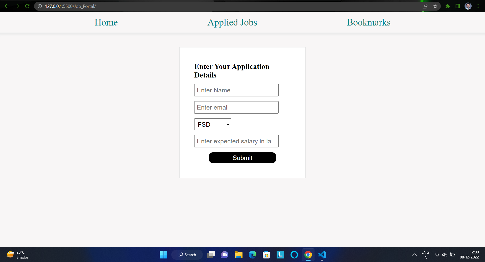
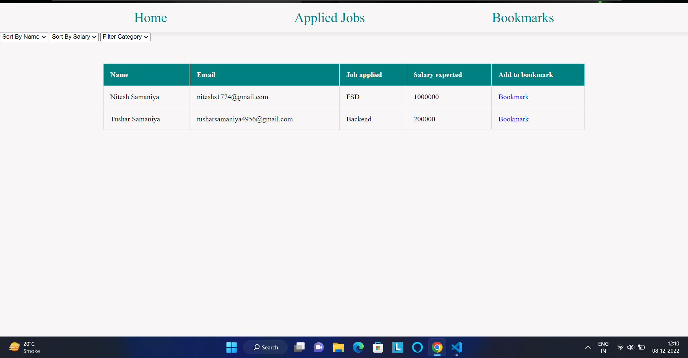
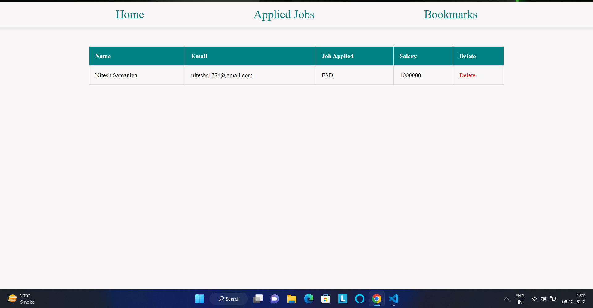

## This is dummy Job Portal app built with HTML, CSS and VANILLA JS. I built this mini project within around 3 hours.

### Features Working:
`User can apply for a particular job`
 
`User can see and filter applied jobs`
 
`User can bookmark the particular job and can see later`

 

 
